# Benchmark of Video Compression


## Methods
- <font color="#0343df">CW_ECCV18</font> : [Video Compression through Image Interpolation](https://arxiv.org/abs/1804.06919)
- <font color="#c2bd1c">DVC</font> : [DVC: An End-to-end Deep Video Compression Framework](https://arxiv.org/abs/1812.00101)
- <font color="#00bfbf">AD_ICCV19</font> : [Neural Inter-Frame Compression for Video Coding](https://openaccess.thecvf.com/content_ICCV_2019/papers/Djelouah_Neural_Inter-Frame_Compression_for_Video_Coding_ICCV_2019_paper.pdf)
- <font color="#00FF00">AH_ICCV19</font> : [Video CompressionWith Rate-Distortion Autoencoders](https://arxiv.org/abs/1908.05717v2)
- <font color="#008000">EA_CVPR20</font> : [Scale-space Flow for End-to-end Optimized Video Compression](https://ieeexplore.ieee.org/stamp/stamp.jsp?tp=&arnumber=9157366)
- <font color="#8A2BE2">HU_ECCV20</font> : [Improving Deep Video Compression by Resolution-adaptive Flow Coding](http://www.ecva.net/papers/eccv_2020/papers_ECCV/papers/123470188.pdf)
- <font color="#ff8c0f">M-LVC</font> : [M-LVC: Multiple Frames Prediction for Learned Video Compression](https://arxiv.org/abs/2004.10290) (questionable)
   

## HEVC Class B dataset
<!-- 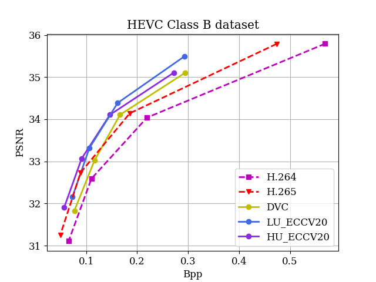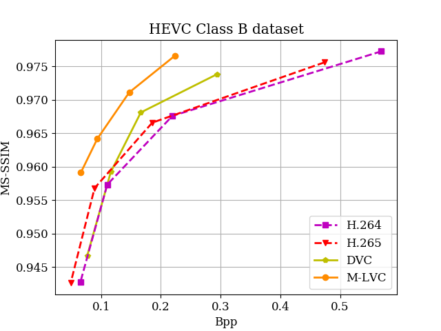 -->
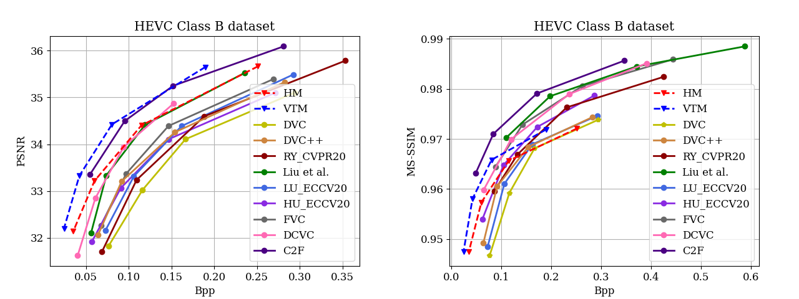
## HEVC Class C dataset
<!-- 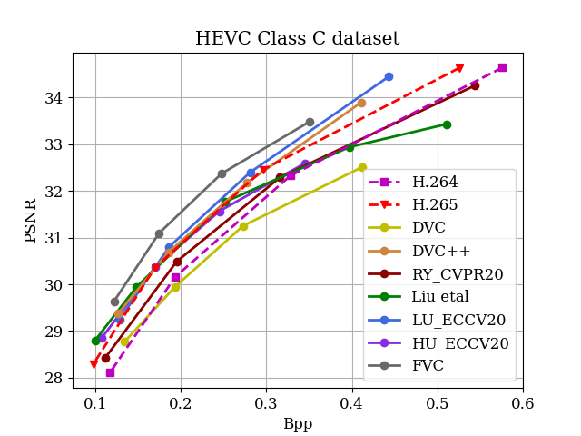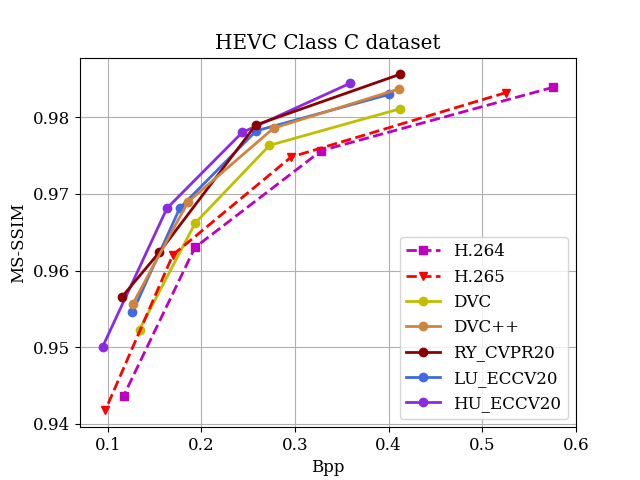 -->
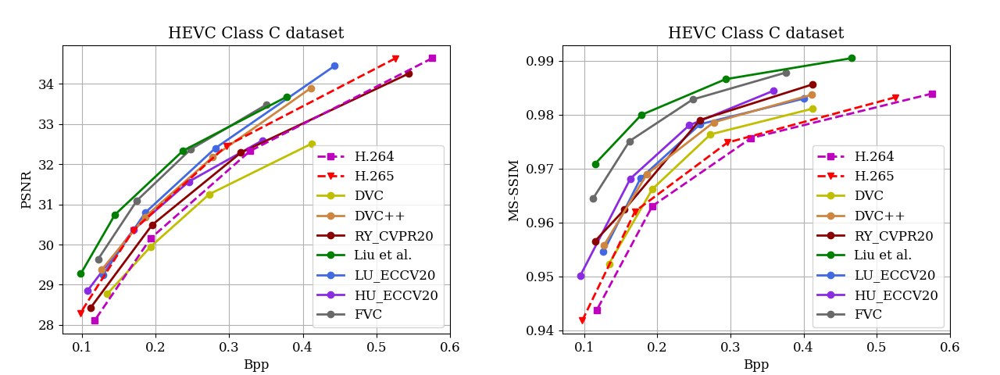
## HEVC Class D dataset
<!-- 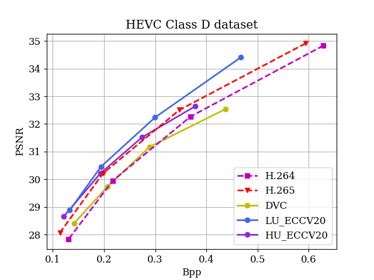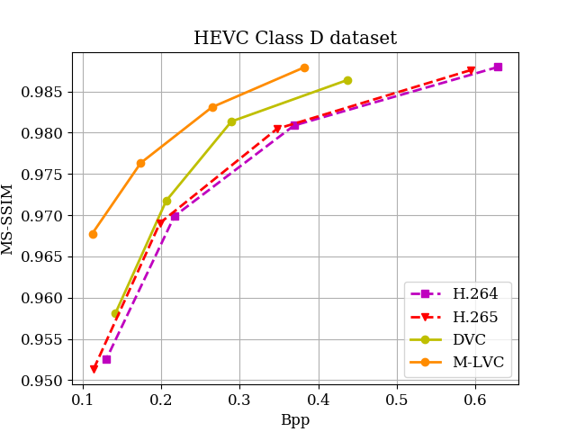 -->
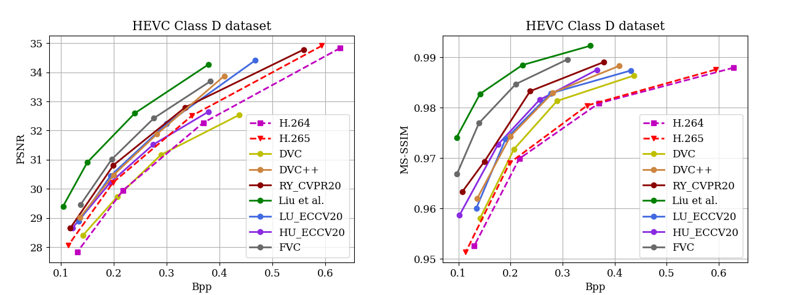
## HEVC Class B dataset
<!-- 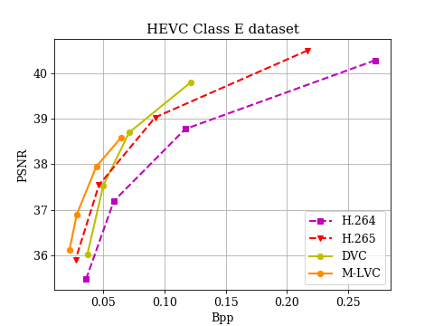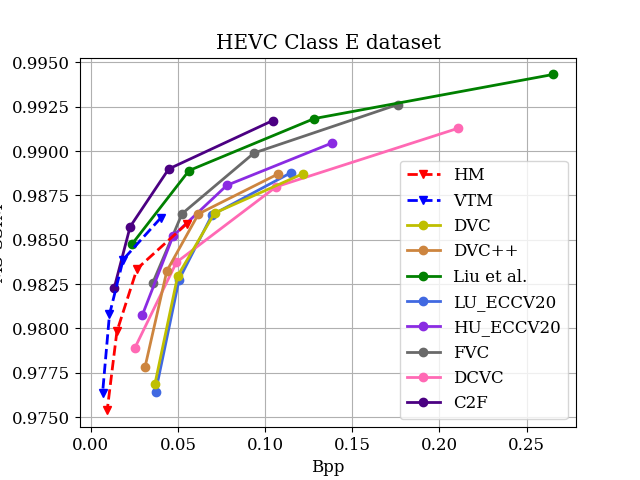 -->
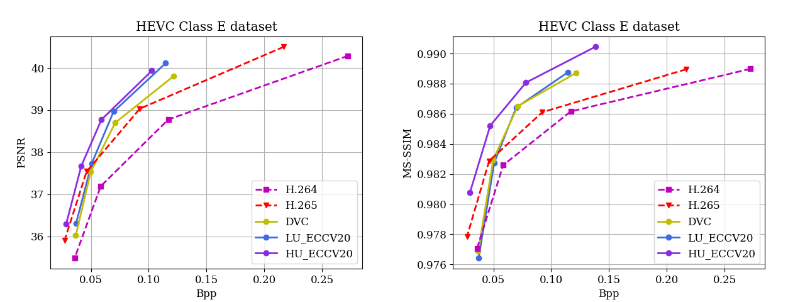
## UVG dataset
<!-- 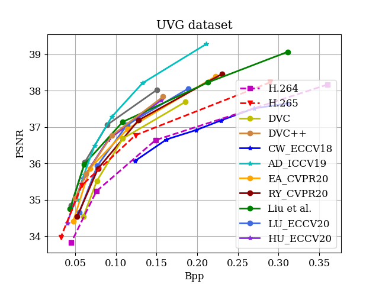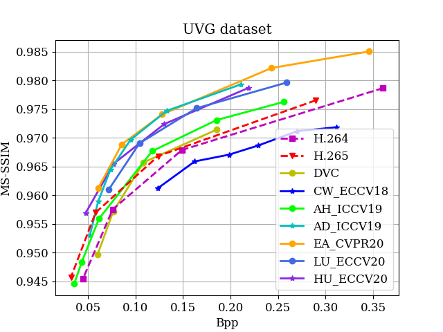 -->
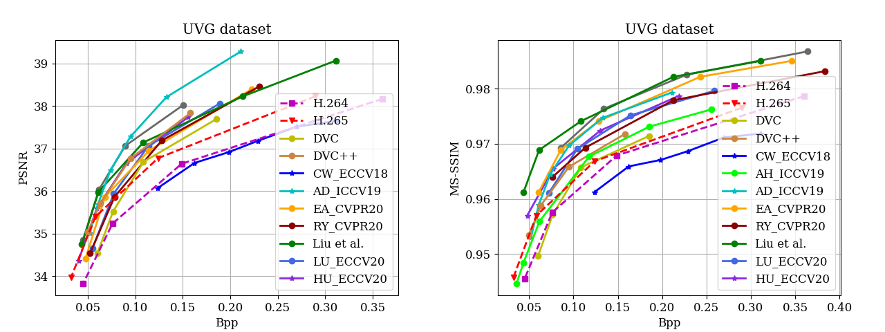
## MCL-JCV dataset
<!-- 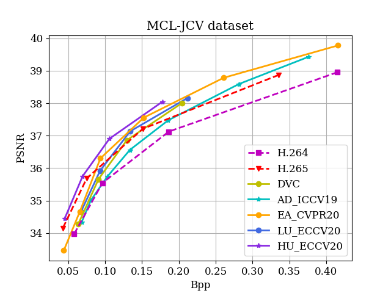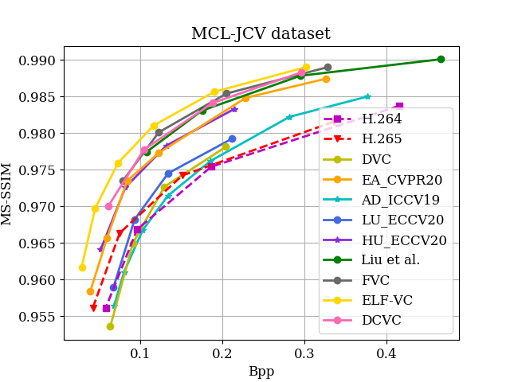 -->
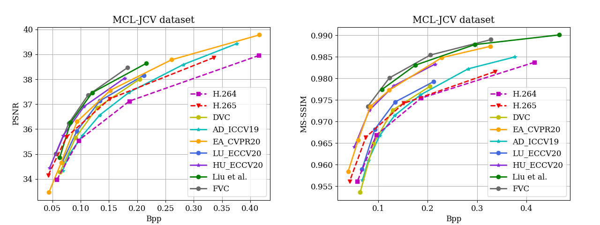
## VTL dataset
<!-- 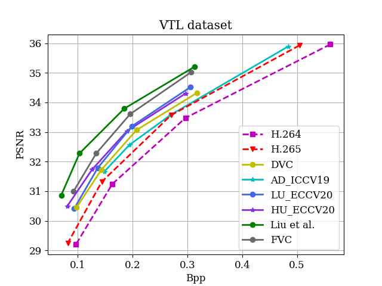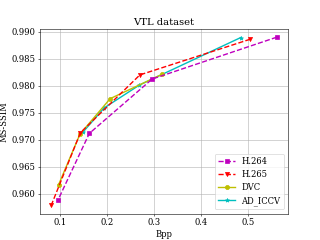 -->
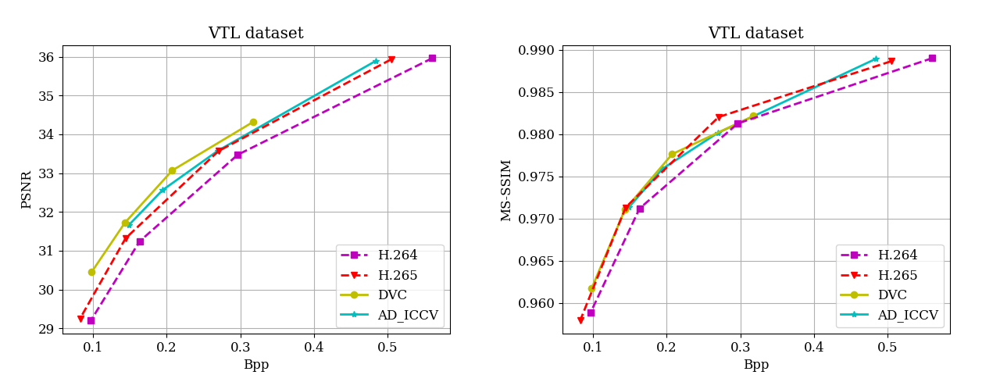


## Setting of H.264 and H.265

### H.264:
```
ffmpeg -pix_fmt yuv420p -s WxH -r FR -i A.yuv -vframes N -c:v libx264 -tune zerolatency -crf Q -g GoP -sc_threshold 0 output.mkv
```

### H.265:

```
ffmpeg -pix_fmt yuv420p -s WxH -r FR -i A.yuv -vframes N -c:v libx265 -tune zerolatency -x265-params "crf=Q:keyint=GoP:verbose=1" output.mkv
```


FR, N, Q, GoP represent the frame rate, the number of frames to be encoded, the quality and the GoP size. Q is set as 19, 23, 27, 31. GoP is set as 10 for the HEVC dataset and 12 for other datasets.

# Contact

If you want to add the results of your paper or have any questions, please file an issue or contact:

    Zhihao Hu: huzhihao@buaa.edu.cn