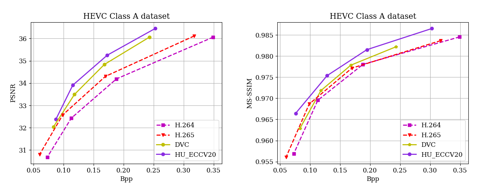

# PyTorch Video Compression
PyTorch implementation and benchmark of Video Compression

## Update
* 2020.08.02: Upload Benchmark of the HEVC, UVG, MCL-JCV, VTL datasets.
* 2020.08.01: Upload PyTorch implementation of [DVC: An End-to-end Deep Video Compression Framework](https://arxiv.org/abs/1812.00101)

## Benchmark

<!-- ### HEVC Class A dataset -->
<!--  -->
### HEVC Class B dataset

### HEVC Class C dataset

### HEVC Class D dataset

### HEVC Class E dataset

### UVG dataset

### MCL-JCV dataset

<!-- ### VTL dataset -->
<!--  -->

# Contact

If you want to add the results of your paper or have any questions, please file an issue or contact:

    Zhihao Hu: huzhihao@buaa.edu.cn